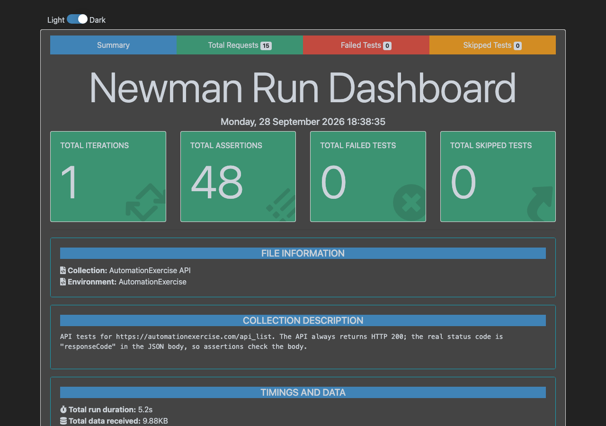
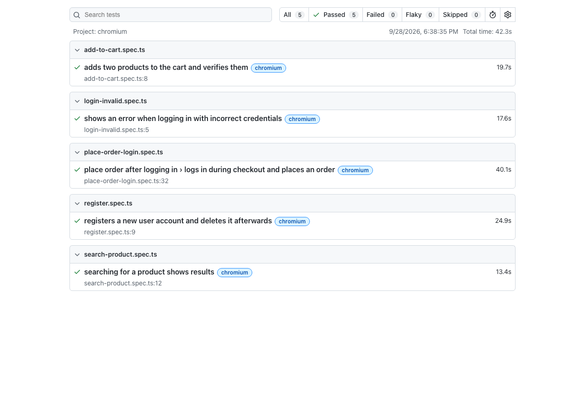
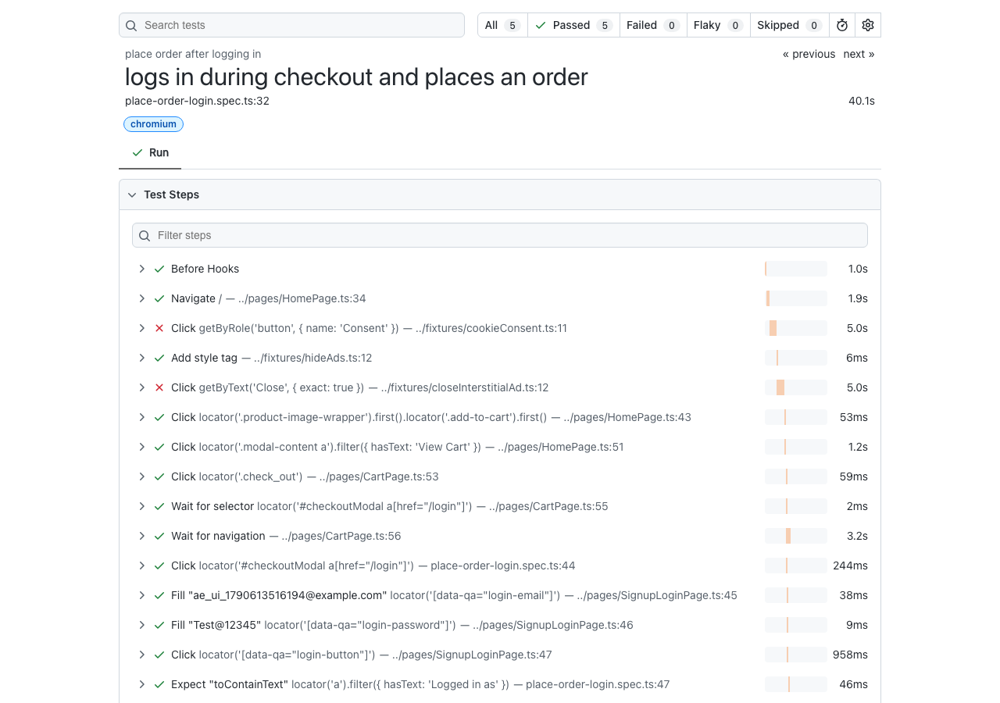
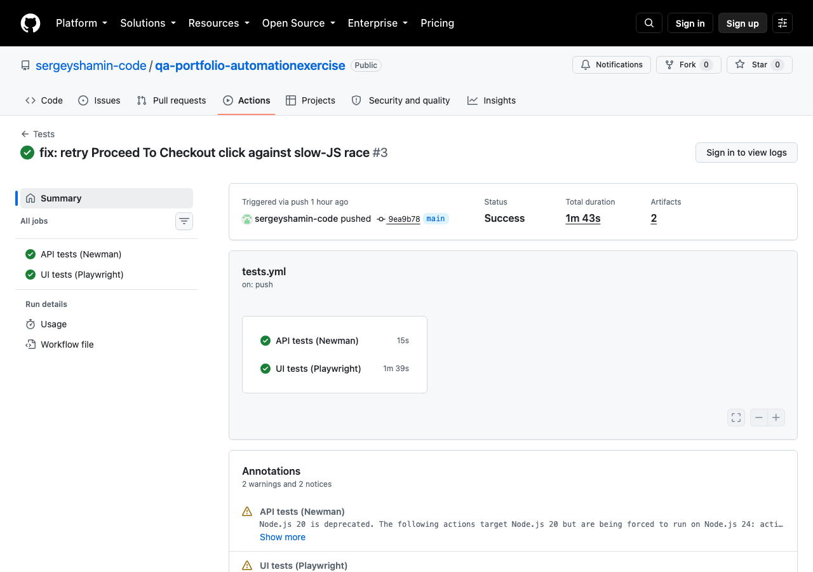

# QA Portfolio: AutomationExercise

[](https://github.com/sergeyshamin-code/qa-portfolio-automationexercise/actions/workflows/tests.yml)

API and UI test automation for [AutomationExercise.com](https://automationexercise.com), a demo e-commerce site built for practicing test automation.

## Tech Stack

- **API tests:** Postman collections, run from the command line with Newman
- **UI tests:** Playwright (TypeScript, Page Object pattern)
- **CI/CD:** GitHub Actions

## What This Demonstrates

- **API testing beyond the happy path:** this API always responds with HTTP 200, even for errors — the real result lives in the JSON body. The suite asserts on that body, and covers a full account lifecycle (create → verify login → read → update → delete), not just isolated calls.
- **UI testing against a real, uncontrolled site:** AutomationExercise serves real ads, a cookie-consent dialog, and a randomly-timed full-page interstitial — all of which intercept clicks unpredictably. Rather than papering over that with `force` clicks, the suite blocks the ad stack at the network level (`ui-tests/fixtures/base.ts`) and retries actions that can race the site's own JS, so failures reflect real bugs, not ad timing.
- **Hybrid API + UI setup:** the checkout test creates its throwaway user via the API (reusing Phase 1's request logic) instead of relying on a fixed, persistent account or a bare `.env` credential — it also deletes it afterwards on the public site.
- **CI that was actually verified, not just written:** the workflow was tested live on a branch before merging, and a real CI-only failure (a click racing the site's JS, only visible on a slower runner) was diagnosed from its log and fixed — not guessed at.

## API Tests

A Postman collection ([`api-tests/AutomationExercise.postman_collection.json`](api-tests/AutomationExercise.postman_collection.json)) covers the [public API](https://automationexercise.com/api_list): product and brand listings, product search, and the full user account lifecycle.

The collection carries sensible default values (`baseUrl`, `name`, `password`) as collection variables, so it also runs standalone straight after importing it into Postman — no environment needs to be selected first. Importing and selecting [`api-tests/AutomationExercise.postman_environment.json`](api-tests/AutomationExercise.postman_environment.json) as well overrides those defaults and matches exactly what Newman/CI run.

**Setup:**

```bash
npm install
```

**Run:**

```bash
npm run test:api
```

Runs the collection with Newman against [`api-tests/AutomationExercise.postman_environment.json`](api-tests/AutomationExercise.postman_environment.json) and writes an HTML report to `api-tests/newman-reports/report.html` (git-ignored; regenerated on every run). The collection also carries sensible defaults as collection-level variables, so it runs standalone straight after importing it into Postman — no environment needs to be selected first.

### Data-driven testing (DDT)

Data-driven folders are prefixed **`DDT:`** (e.g. `DDT: Search Product`), to tell them apart at a glance from the numbered, one-case-per-endpoint folders above. The request inside is prefixed with the number of the official endpoint it exercises (`5. POST To Search Product — {{search_term}}`) — the same `5` as `Read-only endpoints / 5. POST To Search Product` — so it's traceable to the endpoint it's testing a fuller input matrix for.

`DDT: Search Product` runs the same `searchProduct` request, parameterized by `{{search_term}}`:

```bash
npm run test:api:data
```

Runs once per row of [`api-tests/data/search-terms.json`](api-tests/data/search-terms.json) via Newman's `-d` flag — 19 terms, each carrying its *own* expected outcome (`expect_results`), not just an input. Beyond plain happy-path words, the rows cover distinct equivalence classes, each verified live before being added:

- **Case-insensitivity** — `"TOP"` matches the same 14 products as `"top"`.
- **No input trimming** — `"  top  "` (padded) matches nothing; the API doesn't sanitize whitespace.
- **Empty string** — matches the *entire* catalog (34/34): an empty substring is trivially contained in every product, not an error.
- **Substring, not tokenized search** — `"blue top"` matches the one product literally named "Blue Top", but `"top dress"` (two individually-valid words concatenated) matches nothing: the API matches one literal substring, not "contains every word".
- **Field scope** — `"500"` and `"H&M"` both match nothing, even though a price like "Rs. 500" and the brand "H&M" appear in the data; search only looks at name/category, not price or brand.
- **Robustness** — an XSS-shaped string, a SQLi-shaped string, a 200-character string, Cyrillic text, a literal `&` (a form-encoding separator character), and a literal `%` (the URL-encoding escape character itself) all return a normal empty `200` response, not an error.

It's deliberately **excluded** from the default `npm run test:api` run: `Read-only endpoints / 5.` already exercises the same endpoint's happy path (`search_term: "top"`) as part of the complete, numbered API coverage — including it in both commands would just fire the same live HTTP call twice. The DDT folder's reason to exist is the full parameterized matrix, which only `test:api:data` exercises; `npm run test:api` stays each request's single definitive run.

The test script reads both the search term and the expected outcome with `pm.variables.get(...)`, which resolves across scopes (iteration data → environment → collection defaults). The collection also carries `search_term`/`expect_results` as defaults, so the request still runs standalone with a single sensible case straight from Postman's "Send" button — without needing the data file or `-d` at all. One subtlety: Postman stores collection/environment variables as strings, but a value coming from a JSON data file (`-d`) keeps its real JSON type (`true`/`false`, a boolean) — comparing with `String(expectResults) === "true"` handles both consistently; a plain `==` comparison does not (`true == "true"` is `false` in JavaScript).

**Adding another DDT scenario:** this collection follows the common Postman pattern of one folder per scenario, each with its own data file and its own Newman invocation (Newman only accepts a single `-d` file per run, so scenarios with different datasets can't share one command). To add one — e.g. a `DDT: Verify Login` folder, numbered to match endpoint `7`/`8` — add a `api-tests/data/<scenario>.json` file, a matching folder + numbered request in the collection, and a dedicated `test:api:data:<scenario>` npm script (plus a CI step, if it should run there too). If the folder's default case would duplicate an existing numbered request's happy path, leave it out of the default `test:api` run, same as here.

## UI Tests

Playwright tests covering 5 of the site's [documented test cases](https://automationexercise.com/test_cases), using the Page Object pattern (`ui-tests/pages/`):

- Register a new user account (and delete it afterwards)
- Login with incorrect credentials
- Search for a product
- Add products to the cart as a guest
- A full checkout journey: log in, add to cart, check out, pay, get a confirmed order — using a throwaway account created via the API, deleted again at the end

**Setup:**

```bash
npm install
npx playwright install chromium
```

**Run:**

```bash
npm run test:ui
```

Add `--ui` for Playwright's interactive UI mode, or `--headed` to watch the browser. `npm run test:ui:report` opens the last HTML report (git-ignored; regenerated on every run).

## CI

[`.github/workflows/tests.yml`](.github/workflows/tests.yml) runs on every push and pull request to `main`: the API suite (Newman) and the UI suite (Playwright/Chromium) run as two parallel jobs, each uploading its HTML report as a downloadable build artifact.

## Screenshots

| API report (Newman) | UI report (Playwright) |
|---|---|
|  |  |

| Test steps (Playwright trace) | CI run (GitHub Actions) |
|---|---|
|  |  |

## Project Structure

```
api-tests/
  data/                     Data files for data-driven scenarios (one JSON file per scenario)
  *.postman_collection.json / *.postman_environment.json
  newman-reports/           HTML reports (git-ignored)
ui-tests/
  pages/                   Page objects (HomePage, CartPage, CheckoutPage, ...)
  tests/                   Playwright specs, one file per scenario
  fixtures/                Shared helpers: API user setup/teardown, ad blocking, cookie consent
.github/workflows/         CI: tests.yml
docs/screenshots/          Report and CI screenshots (this README)
```

## Roadmap

- [x] **Phase 0 — Setup:** repository structure, `.gitignore`, `.env.example`, README
- [x] **Phase 1 — API tests:** Postman collection covering the public API endpoints, run with Newman
- [x] **Phase 2 — UI tests:** Playwright tests using the Page Object pattern
- [x] **Phase 3 — CI:** GitHub Actions workflow running API and UI tests on every push
- [x] **Phase 4 — Reporting and docs:** test reports, screenshots, final README
